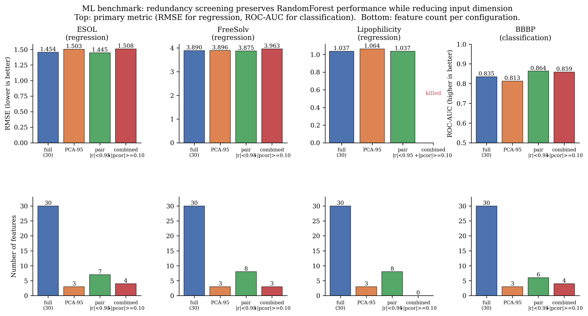

# Orthogonality Screening of Topological Indices for QSPR Modeling

An open-source pipeline for testing whether a proposed scalar
topological index contributes **non-redundant** information beyond
the classical 30-index baseline on QSPR chemistry. Combines pairwise
Pearson correlation, principal-component analysis, partial
correlation with the QSPR target, and variance inflation factor
into a single combined criterion. Runs in seconds per benchmark on
commodity hardware.

The repository accompanies two related manuscripts in preparation:

- **Paper 1 (methodology).** *Orthogonality Screening of Topological
  Indices for QSPR Modeling.* Develops the pipeline, replicates the
  baseline-redundancy pattern across three independent QSPR
  benchmarks (ESOL, FreeSolv, Lipophilicity), and demonstrates that
  the conventional pairwise $|r|<0.95$ screen alone is
  over-permissive: across $20$ alternative-family candidate indices
  on ESOL, $15$ pass the pairwise screen but only $4$ also clear
  $|\mathrm{pcor}(z,y\mid X)|\ge 0.10$.

- **Paper 2 (parametric case study).** *The Wuzi Index Family.*
  Develops a three-parameter bond-incident-degree (BID) family that
  contains $M_2$, Randić, sum-connectivity, and harmonic as special
  cases; derives closed-form values on nine standard graph classes;
  proves a bracket bound and a ratio-bound theorem; conjectures
  extremal graphs for trees, unicyclic, and bicyclic graphs;
  applies the screening pipeline of Paper 1 at $300$ parameter grid
  points across the three QSPR datasets. At every grid point the
  family is statistically redundant with the classical baseline by
  the combined criterion. Computational extremal search across
  trees of order $5 \le n \le 12$ identifies a non-classical
  extremal regime at $(\alpha, \beta, \gamma) = (-1, -1, 1)$
  --- for $n \ge 7$ the observed maximizer is neither a path,
  a star, nor a caterpillar --- whose formal characterization is
  an open problem.

A structural observation — the *Edge-Degree-Pair Basis* — gives a
$10$-dimensional ceiling on the BID family on hydrogen-suppressed
molecular graphs of $\Delta \le 4$. The observation is not new to
the mathematical-chemistry community; this repository's contribution
is the explicit dimension-bound framing and its operational use in
the screening pipeline.

### Scope statement

This repository does **not** claim that the Wuzi family is a
superior topological index, that classical indices are uninformative,
or that orthogonality screening alone certifies QSPR usefulness.
Orthogonality with the classical baseline is necessary but not
sufficient.

---

## Two-paper plan and target venues

Paper 2 (the mathematical case study) is drafted first; Paper 1
(the methodology) follows once Paper 2 has at least an arXiv
identifier, so that Paper 1 can cite it as the worked example.

| Paper | Target venues (realistic) | Draft |
|---|---|---|
| Paper 2 — Wuzi Index Family | *J. Math. Chem.*, *MATCH Commun. Math. Comput. Chem.*, *AKCE Int. J. Graphs Comb.*, *SAR & QSAR Env. Res.* | `docs/paper2_wuzi.tex` |
| Paper 1 — Orthogonality Screening | *Molecular Informatics*, *J. Cheminformatics*, *J. Chem. Inf. Model.* | `docs/paper1_orthogonality_screening.tex` |

Section plans and remaining math gaps are tracked in
`docs/paper2_wuzi_manuscript_skeleton.md` and
`docs/wuzi_bounds_strategy.md`.

---

## Current status

| Component                                                    | Status |
|---|---|
| Wuzi definition + identity tests vs $M_2$, $R$, SCI, $H$     | ✅ done |
| Closed-form Wuzi values on 9 standard graph families         | ✅ done (numerically verified) |
| Edge-contribution function analysis                          | ✅ done |
| Edge-Degree-Pair Basis observation (dim $\le 10$ on $\Delta\le 4$) | ✅ done |
| 30-index baseline on ESOL / FreeSolv / Lipophilicity         | ✅ done |
| Wuzi 100-point grid sweep on each dataset                    | ✅ done |
| Cross-dataset redundancy comparison                          | ✅ done |
| Octane prediction (analog of MATCH §5.1)                     | ✅ done |
| Degeneracy on 106 trees of order 10                          | ✅ done |
| Structure sensitivity on 75 decane isomers                   | ✅ done |
| Reproducible end-to-end pipeline                             | ✅ done |
| Publication-quality figures (PNG + PDF, 8 figures)           | ✅ done |
| Paper 2 §3 bounds in $(n, m, \Delta, \delta)$                | ⏳ math pending |
| Paper 2 §4 bounds via classical indices                      | ⏳ math pending |
| Paper 2 §5 extremal-graph characterization                   | ⏳ math pending |
| Paper 2 §1 introduction + §7 discussion                      | ⏳ writing |
| Paper 1 manuscript                                           | ⏳ scheduled after Paper 2 |

---

## Mathematical formulation

### Wuzi index family

For a simple connected graph $G = (V, E)$ with vertex degrees
$d_u, d_v$ on each edge $uv \in E(G)$, the **Wuzi index family**
is the three-parameter scalar functional

$$W(G; \alpha, \beta, \gamma) = \sum_{uv \in E(G)} (d_u d_v)^{\alpha} (d_u + d_v)^{\beta} \exp\!\left( \gamma \cdot \frac{|d_u - d_v|}{d_u + d_v} \right),$$

with $\alpha, \beta, \gamma \in \mathbb{R}$. Several classical
bond-incident-degree indices are recovered as special cases:

| Parameters                                  | Recovered index                |
|---|---|
| $\alpha = 1$, $\beta = 0$, $\gamma = 0$     | Second Zagreb $M_2$            |
| $\alpha = -1/2$, $\beta = 0$, $\gamma = 0$  | Randić $R$                     |
| $\alpha = 0$, $\beta = -1/2$, $\gamma = 0$  | Sum-connectivity $\mathrm{SCI}$|
| $\alpha = 0$, $\beta = -1$, $\gamma = 0$    | (Half) Harmonic $H/2$          |

When $\gamma = 0$ the family reduces to the standard two-parameter
$(\alpha, \beta)$ degree-based family; the $\gamma$ term introduces
explicit dependence on the normalized degree imbalance
$|d_u - d_v| / (d_u + d_v) \in [0, 1)$ along each edge.

### Edge-Degree-Pair Basis observation

For hydrogen-suppressed molecular graphs with maximum degree
$\Delta \le 4$, the only unordered degree pairs on an edge are
$(i, j)$ with $1 \le i \le j \le 4$, giving $10$ admissible
edge-degree pairs. Let

$$m_{ij}(G) = \bigl| \{\, uv \in E(G) \,:\, \{d_u, d_v\} = \{i, j\} \,\} \bigr|, \qquad 1 \le i \le j \le 4.$$

Then every *endpoint-degree edge-sum* (BID) index
$I_f(G) = \sum_{uv \in E(G)} f(d_u, d_v)$ with $f$ symmetric is a
linear functional of these $10$ counts:

$$I_f(G) = \sum_{1 \le i \le j \le 4} f(i, j) \cdot m_{ij}(G).$$

Hence the vector space spanned by all BID indices has dimension at
most $10$ on this graph class; any $11$ such indices are linearly
dependent. See `docs/theoretical_foundation.md` for the full
statement and proof. The observation that BID indices are linear in
$m_{ij}$ counts is standard in the mathematical-chemistry
literature; the contribution here is the explicit dimension bound
and its application to redundancy screening.

---

## Key results

Baseline pairwise redundancy on the 30-index set
($\binom{30}{2} = 435$ pairs):

| Dataset       | $n$    | Pairs $\lvert r\rvert\ge 0.90$ | Pairs $\lvert r\rvert\ge 0.95$ | PC$_{95}$ |
|---|---:|---:|---:|---:|
| ESOL          | 1127   | 203 / 435 (46.7%)              | 159 / 435 (36.6%)              | 3         |
| FreeSolv      | 639    | 257 / 435 (59.1%)              | 162 / 435 (37.2%)              | 3         |
| Lipophilicity | 4200   | 200 / 435 (46.0%)              | 164 / 435 (37.7%)              | 3         |

PC$_{95}$ denotes the number of principal components needed to
capture 95% of the variance of the 30 standardized indices.
Three components suffice on all three benchmarks; five capture 99%.

Wuzi-family 100-point grid sweep against the same 30-index baseline:

| Dataset       | Pass (max $\lvert r\rvert < 0.95$) | Fail | Min max $\lvert r\rvert$ | Max $\lvert$partial $r$ w/ target$\rvert$ |
|---|---:|---:|---:|---:|
| ESOL          | 0    | 100  | 0.965 | 0.0282 |
| FreeSolv      | 1    | 99   | 0.943 | 0.0362 |
| Lipophilicity | 0    | 100  | 0.965 | 0.0093 |

The single borderline grid point on FreeSolv occurs at
$(\alpha, \beta, \gamma) = (-1, -1, 1)$ with $\max \lvert r\rvert = 0.943$;
its partial correlation with $\Delta G_{\mathrm{hyd}}$ after
controlling for the 30 baseline indices is $\approx 0$, so it does
not carry useful independent QSPR signal. The empirical pattern is
consistent with the dimension-bound observation above: high
redundancy with the classical baseline is the expected behavior of
BID-family indices on this graph class.

Full per-dataset tables are in `results/<dataset>/` and the
cross-dataset summary in `results/cross_dataset_summary.md`.

### Downstream ML benchmark

Whether redundancy screening actually matters for predictive
performance is tested in `scripts/11_ml_benchmark.py`, which
trains a RandomForest on each dataset (including the
classification dataset BBBP, $n=2039$) under four feature
configurations: full $30$-index baseline, top-$k$ PCA at $95\%$
variance, pairwise-pruned at $|r| < 0.95$, and combined
(pairwise + $|\mathrm{pcor}| \ge 0.10$). The headline finding is

| Dataset | Task | RMSE / ROC-AUC `full` (30 feats) | `pairwise_pruned` |
|---|---|---|---|
| ESOL          | regression       | RMSE 1.45, $R^2$ 0.56 | RMSE 1.45 (7 feats) |
| FreeSolv      | regression       | RMSE 3.89, $R^2$ 0.23 | RMSE 3.88 (8 feats) |
| Lipophilicity | regression       | RMSE 1.04, $R^2$ 0.27 | RMSE 1.04 (8 feats) |
| BBBP          | classification   | ROC-AUC 0.835         | ROC-AUC 0.864 (6 feats) |

i.e.\ the pairwise screen matches or marginally improves
RandomForest performance with $4$--$5\times$ fewer features.
The stricter combined screen kills all features on Lipophilicity
(every pairwise-pruned index has $|\mathrm{pcor}| < 0.10$ with
$\log D$), an honest failure mode that the paper reports. Full
table: `results/ml_benchmark.md`; visual summary:



*Top: primary metric (RMSE for the three regression datasets,
ROC-AUC for BBBP). Bottom: feature count under each
configuration.*

---

## How to reproduce results

```bash
git clone https://github.com/Singati2/topological-index-orthogonality.git
cd topological-index-orthogonality
pip install -r requirements.txt
```

### Baseline + Wuzi grid on each dataset

```bash
python scripts/01_baseline_correlations.py --dataset esol            # ~ 1 s
python scripts/01_baseline_correlations.py --dataset freesolv        # ~ 1 s
python scripts/01_baseline_correlations.py --dataset lipophilicity   # ~ 10 s

python scripts/02_wuzi_grid_search.py --dataset esol                 # ~ 2 s
python scripts/02_wuzi_grid_search.py --dataset freesolv             # ~ 1 s
python scripts/02_wuzi_grid_search.py --dataset lipophilicity        # ~ 15 s
```

Outputs land in `results/<dataset>/`.

### Cross-dataset comparison and numerical sections

```bash
python scripts/03_cross_dataset_summary.py     # results/cross_dataset_summary.{csv,md}
python scripts/05_octane_prediction.py         # results/octane_prediction.{csv,md}
python scripts/06_wuzi_degeneracy.py           # results/wuzi_degeneracy.{csv,md}
python scripts/07_structure_sensitivity.py     # results/structure_sensitivity.{csv,md}
python scripts/08_make_figures.py              # figures/*.{png,pdf}
python scripts/11_ml_benchmark.py              # results/ml_benchmark.{csv,md} on 4 datasets incl. BBBP
```

### Adding a new candidate index

1. Implement a function `f(G: nx.Graph) -> float` on the
   H-suppressed molecular graph produced by
   `src.mol_to_graph.smiles_to_graph`.
2. Register it in `src/standard_indices.py` (`ALL_INDICES`) or in
   `src/novel_candidates.py` (`CANDIDATE_INDICES`).
3. Rerun `scripts/01_baseline_correlations.py` per dataset and
   inspect `results/<dataset>/correlation_matrix.csv`,
   `partial_corr_<target>.csv`, and `vif.csv`.

If the candidate is a BID index, the dimension-bound observation
implies it lies in a vector space of dimension at most $10$; the
screening pipeline quantifies how much of that subspace the
30-index baseline already covers.

---

## Datasets

| Name          | Property                                  | Task           | $n$    | Source                       |
|---|---|---|---:|---|
| ESOL          | log aqueous solubility (mol / L)          | regression     | 1 128  | Delaney 2004 / MoleculeNet   |
| FreeSolv      | hydration free energy (kcal / mol)        | regression     | 642    | Mobley 2014 / MoleculeNet    |
| Lipophilicity | octanol-water $\log D$ at pH 7.4          | regression     | 4 200  | ChEMBL / MoleculeNet         |
| BBBP          | blood-brain barrier penetration (yes / no)| classification | 2 050  | Martins 2012 / MoleculeNet   |

All datasets download automatically via `src.load_data.load(name)`
on first use; cached CSVs are written to `data/` (gitignored).

---

## Implemented baseline indices (30)

**Degree-based (18):** First and Second Zagreb ($M_1$, $M_2$),
Modified Zagreb ($mM_1$, $mM_2$), Forgotten ($F$), Randić ($R$),
Sum-connectivity (SCI), Harmonic ($H$), Geometric-arithmetic ($GA$),
Arithmetic-geometric ($AG$), Atom-bond connectivity (ABC),
Atom-bond-sum connectivity (ABS), Augmented Zagreb (AZI),
Sombor ($SO$), Reduced Sombor ($SO_{\mathrm{red}}$),
Albertson irregularity (Alb), Sigma ($\sigma$),
Reduced First Zagreb ($\mathrm{redM}_1$).

**Distance-based (8):** Wiener ($W$), Hyper-Wiener (WW),
Harary (HR), Schultz (MTI), Gutman, Mostar, Szeged (Sz),
Padmakar–Ivan (PI).

**Spectral (3):** Estrada (EE), Graph Energy, Spectral Radius.

**Other (1):** Balaban $J$.

---

## Repository layout

```
src/
  mol_to_graph.py          SMILES -> NetworkX (H-suppressed molecular graph)
  standard_indices.py      30 baseline classical indices
  wuzi_index.py            Wuzi parametric family with special-case identity tests
  wuzi_analytical.py       Closed-form Wuzi values on standard graph families
  novel_candidates.py      20 alternative-family candidate indices (info-theoretic, centrality, ...)
  load_data.py             ESOL / FreeSolv / Lipophilicity loaders
  orthogonality.py         Correlation matrix, PCA, VIF, partial correlation

scripts/
  01_baseline_correlations.py    Per-dataset baseline orthogonality
  02_wuzi_grid_search.py         Per-dataset 100-point Wuzi sweep
  03_cross_dataset_summary.py    Cross-dataset redundancy table
  04_novel_candidates_test.py    Screening of 20 alternative-family candidates on ESOL
  05_octane_prediction.py        MATCH §5.1 analog on 18 octanes
  06_wuzi_degeneracy.py          MATCH §5.3 analog on 106 trees of order 10
  07_structure_sensitivity.py    MATCH §5.4 analog on 75 decane isomers
  08_make_figures.py             Generates the 8 manuscript figures
  09_wuzi_bounds_tables.py       Brute-forces ratio-bound constants c_min^h / c_max^h
  10_wuzi_extremal_search.py     Enumerates trees of order 5..12; observed extremals
  11_ml_benchmark.py             RandomForest on 4 datasets with 4 feature configurations

docs/
  theoretical_foundation.md      Edge-Degree-Pair Basis observation
  edge_contribution_analysis.md  Edge-contribution function analysis
  phase2_plan.md                 Section-by-section paper plan
  paper2_wuzi_manuscript_skeleton.md   Paper 2 skeleton with math gaps marked
  literature_notes.md            Citation discipline document
  figure_audit.md                Figure-by-figure consistency record
  figure_captions.md             Manuscript-ready figure captions
  advisor_update.md              Update document for Arockiaraj sir
  collaboration.md               Contributor workflow

figures/                          Publication-quality figures (PNG + PDF)
  fig2_pca_scree                  Cross-dataset PCA scree (3 components -> 95%)
  fig3_redundancy_bars            Per-dataset redundant-pair counts at three thresholds
  fig4_octane_heatmap             Octane prediction: signed correlation with 8 properties
  fig5_wuzi_param_heatmaps        Wuzi redundancy screen on ESOL
  fig5b_wuzi_param_heatmaps_all   Wuzi redundancy screen across all three datasets
  fig6_degeneracy_bars            Index degeneracy on 106 trees of order 10
  fig7_structure_sensitivity      Structure sensitivity on 75 decane isomers
  fig8_correlation_heatmap        Full 30-index pairwise correlation matrix (ESOL)
  fig9_ml_benchmark               RandomForest performance and feature count across 4 datasets and 4 configurations

results/                          Reproducible outputs by dataset
data/                             Cached download CSVs (gitignored)
```

---

## What remains unfinished

1. Paper 2 §3, §4, §5 — bounds in graph parameters, bounds in
   classical indices, and extremal-graph characterizations.
   Graph-theoretic derivations following the MATCH 95:141–162
   template.
2. Paper 2 manuscript prose — Introduction, Discussion, Conclusion.
3. Resolution of every `[REFERENCE NEEDED]` placeholder in
   `docs/literature_notes.md` by reading the source.
4. Paper 1 manuscript, scheduled after Paper 2 lands.

---

## Citation

```
[CITATION PLACEHOLDER — manuscript in preparation]

A. Natarajan, G. Shiwakoti, M. Arockiaraj.
"The Wuzi Index Family: Graph-Theoretic Properties, Bounds,
 Extremal Graphs, and Redundancy Analysis."
In preparation, 2026.
```

## License

MIT License. See `LICENSE`. Code is openly available; please cite
the manuscript above (once published) for academic use.
